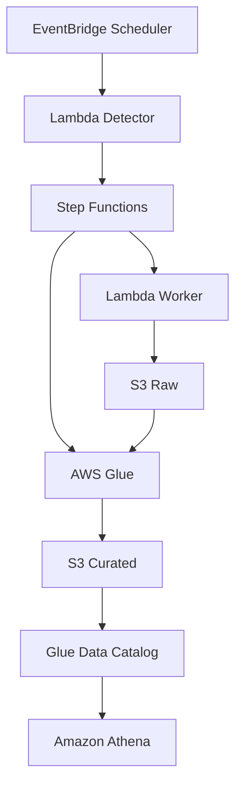

# Social Benefits Data Pipeline AWS

Pipeline serverless para ingestão e análise de dados públicos agregados do
Programa Bolsa Família. A solução detecta novas competências mensais, coleta
dados por município, mantém checkpoints no Amazon S3, transforma os registros
com AWS Glue/PySpark e disponibiliza consultas no Amazon Athena.

> **Projeto demonstrativo de portfólio:** a infraestrutura em nuvem não permanece
> provisionada. Os arquivos de infraestrutura e os workflows representam uma
> implementação reproduzível de referência, sem credenciais ou identificadores
> reais de uma conta AWS.

## Competências demonstradas

- ingestão incremental orientada a eventos;
- processamento resiliente em lotes;
- checkpoints e idempotência;
- arquitetura serverless;
- data lake com camadas raw e curated;
- transformação distribuída com PySpark;
- catálogo de dados e consultas SQL;
- segredos fora do código;
- infraestrutura parametrizada;
- testes, lint e validação contínua.

## Arquitetura



A chave da API é obtida do AWS Secrets Manager. O worker respeita limites da
fonte, salva checkpoints e usa marcadores `_SUCCESS` para impedir
reprocessamentos desnecessários.

## Estrutura

| Caminho | Finalidade |
| --- | --- |
| `src/detector` | Detecta uma nova competência e inicia a Step Function |
| `src/ingestion_worker` | Coleta dados municipais em lotes e grava no S3 |
| `src/dimension_loader` | Carrega a dimensão pública de municípios do IBGE |
| `glue/` | Transforma JSON raw em Parquet particionado |
| `stepfunctions/` | Define a orquestração do pipeline |
| `athena/` | Cria tabelas e inclui consultas analíticas |
| `infrastructure/` | Template AWS SAM/CloudFormation parametrizado |
| `tests/` | Testes unitários sem acesso à AWS |
| `docs/` | Arquitetura, deploy, segurança e modelo de dados |

## Fluxo de dados

1. O EventBridge Scheduler executa o detector diariamente.
2. O detector identifica a competência seguinte ao último marcador `_SUCCESS`.
3. Quando a API publica o mês, uma execução determinística da Step Function é iniciada.
4. O worker percorre os municípios, respeita o rate limit e salva checkpoints.
5. Ao concluir, o Glue transforma os JSONs em Parquet particionado por ano e mês.
6. As partições são registradas no Glue Data Catalog e consultadas pelo Athena.

## Execução dos testes

Requer Python 3.12 ou superior.

```bash
python -m venv .venv
source .venv/bin/activate
pip install -e ".[dev]"
ruff check src tests
pytest -q
```

Os testes usam mocks; não precisam de conta AWS nem fazem chamadas externas.

## Deploy de referência

O template não contém número de conta, bucket ou ARN real. Consulte
[docs/DEPLOY.md](docs/DEPLOY.md) para os parâmetros e passos. O script do Glue
deve ser enviado a um bucket de artefatos e informado por `GlueScriptUri`.

Não é necessário realizar o deploy para avaliar o projeto como portfólio.

## Segurança e dados

- nenhuma credencial é armazenada no repositório;
- a chave do Portal da Transparência fica no Secrets Manager;
- nomes e ARNs são resolvidos no deploy;
- os dados processados são agregados por município;
- snapshots exportados de ambientes AWS não são versionados.

Veja [docs/SECURITY.md](docs/SECURITY.md).

## Fonte dos dados

- Portal da Transparência — API de dados do Novo Bolsa Família;
- IBGE — API de Localidades para a dimensão de municípios.

O consumidor é responsável por respeitar os termos, limites e disponibilidade
das APIs oficiais.

## Licença

Código disponibilizado sob a [Licença MIT](LICENSE).
